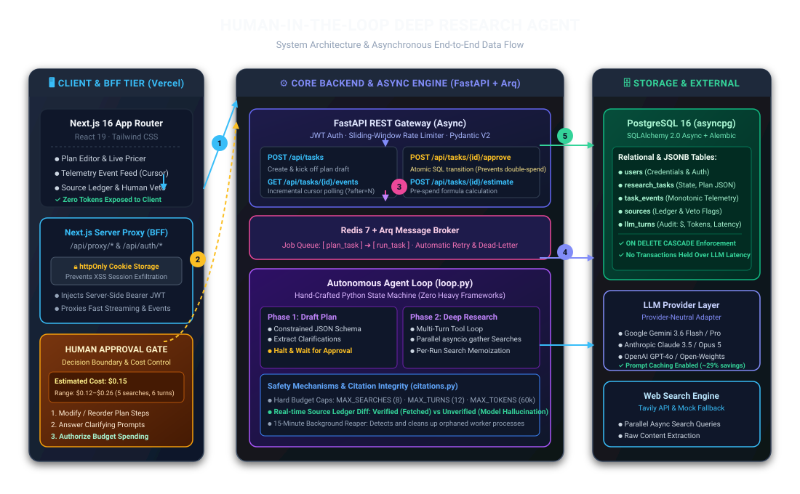
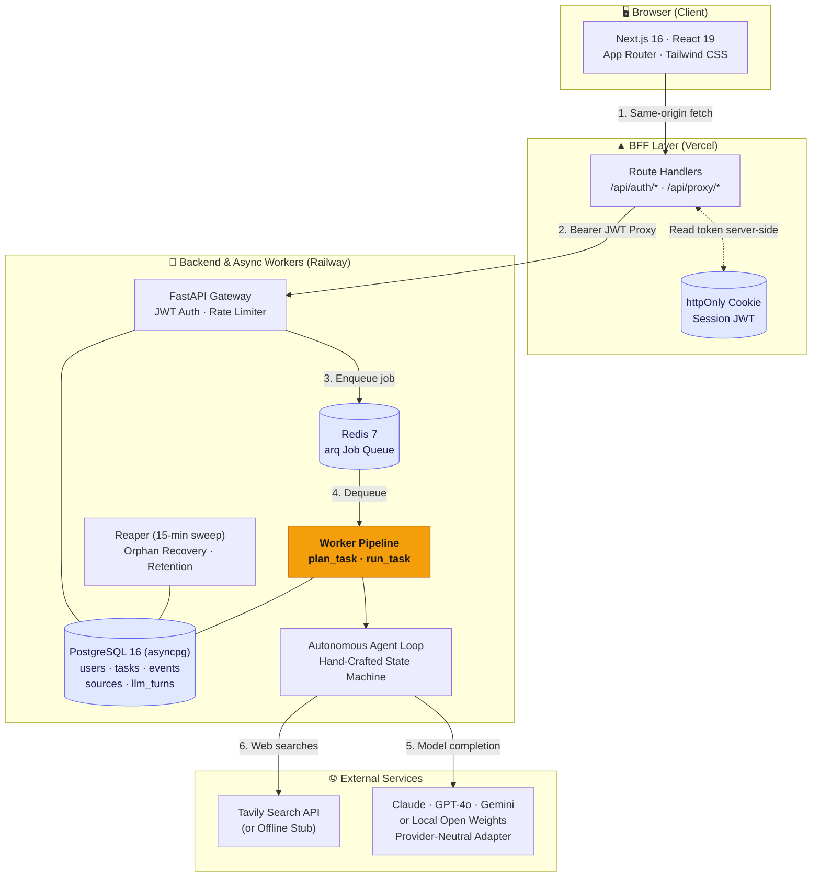

# Human in the Loop

A deep-research agent that **asks permission before it spends your money**, and
**proves its sources exist** before it hands you a report.

Most research agents are a prompt box wired to a tool loop: you ask, it burns
tokens unattended, and you get prose full of confident citations you have to
check by hand. This one puts a person at the two moments that matter — before
the spend, and after the claims.

> **Live demo:** _not yet deployed — see [Deployment](#deployment) for the
> 15-minute path to a public URL._

---

## The two ideas

### 1. The approval gate has a price tag

The agent drafts a plan, then **stops**. You see the steps, edit them, answer any
clarifying questions — and see **what approving it will cost**, recalculated as
you add or remove steps.

```
Estimated cost to run this plan
$0.15          range $0.12–$0.26
~5 searches    ~6 model turns     claude-opus-5
```

An approval screen that only asks "does this look right?" is a rubber stamp.
Showing the dollar figure makes it a decision. Not one token of research spend
happens before you click.

### 2. Every citation is checked against what was actually retrieved

The agent keeps a ledger of every URL a search really returned. When the report
is written, its links are diffed against that ledger:

- **Verified** — the agent genuinely fetched this page.
- **Unverified** — the URL appears in the report but _no search ever returned
  it_. It came from the model's memory.

Unverified links are surfaced in the UI and stored on the task. This is a
mechanism, not a prompt instruction — which is why it can be trusted. See
[`api/app/agent/citations.py`](api/app/agent/citations.py).

---

## Architecture & Data Flow



### End-to-End Data Flow



### How Data Flows Through the System

1. **Task Submission & BFF Auth**: The user submits a research question in React 19. The browser issues a same-origin request to the Next.js BFF proxy (`/api/proxy/*`). The server-side route handler reads the `httpOnly` session cookie, attaches the `Authorization: Bearer <JWT>` header, and proxies the payload to FastAPI. **The token never touches client-side JavaScript.**
2. **Phase 1: Planning & Pre-Spend Estimation**: FastAPI records the task with status `queued` in PostgreSQL and enqueues a `plan_task` job into Redis. The background worker picks up the job, invokes the LLM via JSON-schema constrained generation to extract clarifying questions and formulate a structured plan, pre-calculates the expected dollar cost using exact model pricing formulas, updates the task to `awaiting_approval`, and halts.
3. **The Human Approval Gate**: The user reviews the plan in the dashboard, modifies or reorders steps, and answers clarifying prompts. The UI updates the dollar budget dynamically in real time. When the user clicks **Approve**, FastAPI executes an atomic conditional SQL `UPDATE ... WHERE status = 'awaiting_approval' RETURNING id`. Only the winning request transitions to `researching` and enqueues `run_task`.
4. **Phase 2: Autonomous Multi-Turn Execution**: The worker runs the research loop. At each turn, tool calls emitted by the LLM are executed concurrently via `asyncio.gather` against the search API. Search results are memoized in memory and appended to the relational `sources` ledger. Progress telemetry is written to `task_events`, which the frontend polls incrementally using cursor sequence numbers (`GET /events?after=N`).
5. **Phase 3: Citation Audit & Delivery**: When the synthesis report is produced, the agent extracts all Markdown and bare URLs and diffs them against the database-backed source ledger. URLs genuinely fetched are tagged **Verified**; uncited or hallucinated URLs are flagged **Unverified**. All token usage, dollar costs, and latencies are durably recorded in `llm_turns`.

---

## The "Why": Engineering Deep Dive

### 1. What was the hardest bug you hit?

**Symptom:** During early testing, tasks would intermittently freeze in the `planning` state forever. The UI showed "Formulating Research Plan", but no errors were logged, no telemetry events were emitted, and the task row in PostgreSQL never updated. Only the 15-minute background orphan reaper would eventually mark the task failed.

**Root Cause Analysis:**
The task successfully transitioned to `planning`, meaning database connectivity and job dequeue were healthy. The freeze occurred immediately when initializing the LLM provider. Inspecting the environment revealed `ANTHROPIC_API_KEY=""` (an empty string in `.env` instead of being unset).

In Python, an empty string evaluates to truthy in string contexts but fails validation in SDK constructors. The official Anthropic SDK attempted to parse the empty string, failed internal authentication checks, and raised a standard Python `TypeError: Could not resolve authentication method. Expected one of api_key, auth_token, or credentials to be set.`

Because `TypeError` is a built-in Python standard library exception rather than an `AnthropicError` or `LLMError` subclass:

1. The adapter's `except (AnthropicError, LLMError)` block completely missed it.
2. The exception escaped into the fire-and-forget `asyncio.create_task()` background coroutine.
3. The coroutine died silently without ever invoking the failure callback or writing an error status to PostgreSQL.

**The Three-Layer Defensive Solution:**
To ensure this entire class of silent failure is impossible across all providers:

1. **Sanitization at Configuration Boundary**: In `api/app/config.py`, all API key fields coerce empty strings `""` to `None`. This preserves standard SDK environment fallback (e.g., local profiles, OS environment variables) without passing poisoned empty strings.
2. **Comprehensive Exception Mapping in Adapters**: Wrapped provider constructor and creation logic to catch both vendor SDK errors and standard library exceptions (`TypeError`, `ValueError`), mapping them into actionable `LLMError("API key is missing or invalid...")`.
3. **Broad Supervisor Safety Net**: Added an outer `except Exception` supervisor around background worker coroutines with dead-letter queue logging, guaranteeing that no matter what exception occurs, the database row is atomically transitioned to `status = 'failed'` with a human-readable diagnosis in the UI under 1 second.

---

### 2. Why choose PostgreSQL over MongoDB?

While MongoDB's document model is often chosen for rapid LLM prototyping, deep research agent workloads have specific architectural requirements that make PostgreSQL + `asyncpg` fundamentally superior:

| Requirement                     | Why PostgreSQL Wins                                                                                                                                                                     | Why MongoDB Falls Short                                                                                                                                                                                    |
| ------------------------------- | --------------------------------------------------------------------------------------------------------------------------------------------------------------------------------------- | ---------------------------------------------------------------------------------------------------------------------------------------------------------------------------------------------------------- |
| **Relational Data Integrity**   | A user owns tasks; a task owns events, sources, and turns. 4 explicit foreign keys with declarative `ON DELETE CASCADE`. Account deletion is a single guaranteed SQL statement.         | Cascades require custom application-level cleanup logic across collections that easily drifts and leaves orphaned telemetry data.                                                                          |
| **Race-Free Gate Transitions**  | Conditional atomic update: `UPDATE research_tasks SET status = 'researching' WHERE id = :id AND status = 'awaiting_approval' RETURNING id`. Loser gets 0 rows and HTTP 409.             | `findOneAndUpdate` can do atomic updates, but lacks SQL's clean declarative constraint guarantees when coordinating cross-table state transitions.                                                         |
| **Incremental Event Streaming** | `task_events` are appended as discrete rows with monotonic sequence IDs (`seq`). Polling with `WHERE task_id = :id AND seq > :cursor` is an indexed, sub-millisecond B-tree range scan. | Appending events to an embedded array inside a `task` document requires rewriting the entire document on every tool call and telemetry tick, causing document fragmentation and heavy write amplification. |
| **Audit & Cost Analytics**      | Calculating token spend, cache hit ratios, and budget rollups is straightforward SQL: `SELECT model, SUM(cost_usd), SUM(input_tokens) FROM llm_turns GROUP BY model`.                   | Aggregation pipelines in Mongo require verbose multi-stage syntax for relational rollups across runs and users.                                                                                            |
| **Hybrid Document Flexibility** | PostgreSQL provides native `JSONB` columns for unstructured data (draft plan steps, dynamic clarification Q&As, citation audit reports).                                                | Postgres gives the benefits of document storage (JSONB) without sacrificing relational guarantees, ACID transactions, or foreign keys.                                                                     |

Schema migrations are managed strictly through **Alembic**, ensuring all database changes are tracked in version control, reversible, and auditable.

---

### 3. How did you optimize performance?

Research agents run long multi-turn loops. To make the system fast, responsive, and cost-effective, five targeted performance optimizations were engineered:

#### A. Prompt Prefix Caching (~29% Cost & Latency Reduction)

The system prompt and tool definitions (`SEARCH_TOOL`) remain byte-identical across every turn of a multi-step investigation. By placing static instructions and tool definitions at the prefix and applying provider cache breakpoints, subsequent turns read prompt tokens from cache at **10% of standard input pricing** with near-instant Time-To-First-Token (TTFT).

#### B. Parallel Tool Execution via `asyncio.gather`

When an LLM generates multiple search queries in a single response turn (e.g. searching for 3 independent facts simultaneously), naive loops execute them sequentially ($3 \times 1.2\text{s} = 3.6\text{s}$). The engine runs all tool calls in parallel using `asyncio.gather` while maintaining exact wire-protocol index ordering:

```python
tool_results = await asyncio.gather(*[
    self._execute_tool(call, memo, source_ledger) for call in response.tool_calls
])
```

This collapses $N$ search operations into the latency of a single roundtrip.

#### C. Flat $O(1)$ Incremental Telemetry Polling

Rather than refetching the entire task (including all historical Markdown, events, and retrieved web sources) on every poll cycle, the frontend and API implement a monotonic sequence cursor (`GET /api/tasks/{id}/events?after=N`).

- The payload size per polling tick remains constant (a few hundred bytes).
- Full task re-fetch occurs exactly once when a terminal or gate status transition happens.

#### D. Zero-Hold Database Connections Across LLM Calls

LLM generation and external search take between 5 to 30 seconds per turn. Holding an active PostgreSQL transaction across external network calls would quickly exhaust connection pools. The worker uses **scoped, short-lived sessions**: it reads task state, immediately commits/releases the connection, executes the model call, and opens a fresh brief session to write telemetry events.

#### E. Per-Run Search Memoization

If the agent issues duplicate search queries across iterative reasoning turns, the in-memory memo cache intercepts the request, returning the existing snippet without making an external HTTP request or consuming search quota.

---

## Testing

**117 tests, all hermetic** — no API key, no network, no spend. The agent is
driven by scripted fake providers, so the loop's guarantees are tested as
properties of _our_ code rather than of a model's behaviour.

```bash
cd api && .venv/bin/python -m pytest -q
# 117 passed
```

| Suite                     | Tests | What it pins down                                                                                                                              |
| ------------------------- | ----: | ---------------------------------------------------------------------------------------------------------------------------------------------- |
| `test_agent_loop.py`      |    21 | Spend caps (search/turn/token), cancellation mid-run, source vetoes, parallel tool execution, result ordering, memoisation, empty-report guard |
| `test_open_model.py`      |    13 | Open-weight backends over **real HTTP** against a stub server: capability degradation, credential guard, zero-cost local pricing               |
| `test_auth.py`            |    13 | Registration, login, account deletion cascade                                                                                                  |
| `test_jobs_pipeline.py`   |    11 | Planning → pricing → approval, citation auditing, telemetry, and the wedged-task regressions                                                   |
| `test_approval_gate.py`   |    10 | **Concurrent double-approval starts exactly one run**, edit detection, cursor feed, cross-user isolation                                       |
| `test_tasks.py`           |    10 | Task lifecycle endpoints                                                                                                                       |
| `test_reaper.py`          |    10 | Orphan detection, live runs left alone, retention purge                                                                                        |
| `test_pricing.py`         |     7 | Cost maths, cache discount, estimate bounds, unpriced-model flagging                                                                           |
| `test_citations.py`       |     6 | URL normalisation, invented-citation detection                                                                                                 |
| `test_gemini_provider.py` |     5 | Gemini adapter wire format                                                                                                                     |
| `test_ratelimit.py`       |     4 | Sliding window, per-key isolation, window expiry                                                                                               |
| `test_retry.py`           |     4 | Transient retried, fatal not retried, attempt accounting                                                                                       |
| `test_public.py`          |     3 | Public report visibility rules                                                                                                                 |

The tests worth reading first are `test_approval_gate.py::test_concurrent_approvals_only_start_one_run`
and `test_jobs_pipeline.py::test_invented_citation_is_caught_and_surfaced` —
they encode the two claims this project actually makes.

---

## Local development

**Requirements:** Python 3.13+, Node 20+, PostgreSQL 16 (or use Docker).

### With Docker (full stack, including Redis + worker)

```bash
cp .env.example .env          # set JWT_SECRET and at least one model key
docker compose up --build
```

Web on `:3000`, API on `:8000`, Swagger on `:8000/docs`.

### Without Docker

```bash
# Postgres
createdb hitl

# API
cd api
python3 -m venv .venv && .venv/bin/pip install -r requirements.txt
cp ../.env.example .env       # then set DATABASE_URL + JWT_SECRET
.venv/bin/alembic upgrade head
.venv/bin/uvicorn app.main:app --reload --port 8000

# Web (second terminal)
cd web && npm install && npm run dev
```

With no `REDIS_URL`, jobs run in-process — fine on a laptop, but a restart
mid-run orphans the task (the reaper will fail it cleanly). With no
`TAVILY_API_KEY`, search falls back to a clearly-labelled stub so the whole flow
is still demoable.

**macOS note:** PDF export needs Pango. `brew install pango`, and run the API
with `DYLD_FALLBACK_LIBRARY_PATH=/opt/homebrew/lib`. Without it, PDF export
returns a clean 503 rather than failing at boot.

### Configuration

| Variable                                                  | Default        | Notes                                                                                                                                |
| --------------------------------------------------------- | -------------- | ------------------------------------------------------------------------------------------------------------------------------------ |
| `DATABASE_URL`                                            | local Postgres | `sqlite+aiosqlite:///./hitl.db` works as a no-daemon fallback                                                                        |
| `REDIS_URL`                                               | unset          | Unset ⇒ jobs run in-process                                                                                                          |
| `JWT_SECRET`                                              | —              | **Required in production.** `python -c "import secrets; print(secrets.token_urlsafe(48))"`                                           |
| `LLM_PROVIDER`                                            | `gemini`       | `anthropic` \| `openai` \| `gemini`, or an open-weight backend — see [Running on open-weight models](#running-on-open-weight-models) |
| `ANTHROPIC_API_KEY` / `OPENAI_API_KEY` / `GEMINI_API_KEY` | unset          | Leave _unset_, not empty — see [the hardest bug](#the-hardest-bug)                                                                   |
| `ANTHROPIC_MODEL` / `OPENAI_MODEL` / `GEMINI_MODEL`       | per provider   | Model id for the hosted APIs                                                                                                         |
| `OPEN_MODEL_NAME`                                         | `llama3.1:8b`  | Model id for an open-weight backend                                                                                                  |
| `OPEN_MODEL_BASE_URL`                                     | unset          | Only for endpoints that aren't a known preset                                                                                        |
| `OPEN_MODEL_API_KEY`                                      | unset          | Local runtimes ignore it; hosted ones require it                                                                                     |
| `OPEN_MODEL_PRICE_INPUT` / `_OUTPUT`                      | `0.0`          | USD per 1M tokens; `0` is correct for local                                                                                          |
| `TAVILY_API_KEY`                                          | unset          | Unset ⇒ stub search                                                                                                                  |
| `MAX_SEARCHES_PER_TASK`                                   | `8`            | Hard cap per task                                                                                                                    |
| `MAX_TOOL_ITERATIONS`                                     | `12`           | Hard cap per task                                                                                                                    |
| `MAX_OUTPUT_TOKENS_PER_TASK`                              | `60000`        | Hard cap per task                                                                                                                    |
| `MAX_TASKS_PER_USER_PER_DAY`                              | `25`           | Per-user quota                                                                                                                       |
| `DATA_RETENTION_DAYS`                                     | `0`            | `0` keeps history forever — an explicit choice                                                                                       |
| `AUTO_CREATE_SCHEMA`                                      | `true`         | Set `false` in production; Alembic owns the schema                                                                                   |

---

## Running on open-weight models

The agent talks to models through one narrow interface
([`app/llm/base.py`](api/app/llm/base.py)), so the backend is a config change,
not a rewrite. Every way of serving open weights — Ollama, llama.cpp, vLLM,
OpenRouter, Groq, Together — exposes the same OpenAI-compatible endpoint, so
they share one adapter
([`openai_compatible.py`](api/app/llm/openai_compatible.py)).

### Free and local, via Ollama

```bash
brew install ollama && ollama serve
ollama pull llama3.1:8b

# api/.env
LLM_PROVIDER=ollama
OPEN_MODEL_NAME=llama3.1:8b
```

That's the whole change. No API key, no per-token cost — and the approval gate
correctly shows **$0.00** rather than guessing a price, because a model on your
own hardware genuinely costs nothing per token.

### Hosted open weights

```bash
LLM_PROVIDER=openrouter          # or groq, together, fireworks
OPEN_MODEL_NAME=meta-llama/llama-3.3-70b-instruct
OPEN_MODEL_API_KEY=sk-or-...
OPEN_MODEL_PRICE_INPUT=0.60      # so cost estimates are real, not guessed
OPEN_MODEL_PRICE_OUTPUT=0.60
```

Any other OpenAI-compatible server works with `LLM_PROVIDER=open` plus
`OPEN_MODEL_BASE_URL`.

### What the adapter handles for you

Hosted frontier APIs implement every optional feature; a local runtime often
does not. Rather than demanding a lowest common denominator, the adapter probes
and degrades, latching each result so the cost is one wasted request per
process rather than one per call:

| Capability        | Chain                                                                             |
| ----------------- | --------------------------------------------------------------------------------- |
| Structured output | `json_schema` → `json_object` + schema in the prompt → parse what the model wrote |
| Token limit       | `max_completion_tokens` → `max_tokens`                                            |

### Choosing a model

**Tool calling is the requirement**, not parameter count — the research loop is
a tool loop, and a model that cannot call `web_search` reliably cannot do the
job however well it writes. Llama 3.1+, Qwen 2.5+, and Mistral-family
instruct models support it; many smaller or older open models do not.

Two honest caveats:

- **Quality drops.** Smaller open models plan less well and are likelier to
  invent citations. The citation audit will catch the invented ones — which
  makes running an 8B model locally a rather good way to _see_ the audit work.
- **Verified against a stub, not a live model.** The adapter has 13 tests
  including real HTTP round trips against a stub OpenAI-compatible server, but
  it has not been run against an actual Ollama instance on this machine.

---

## Deployment

Two services. Roughly 15 minutes.

### Backend → Railway

1. **New Project → Deploy from GitHub repo**, root directory `api`.
   [`railway.json`](api/railway.json) and the [`Dockerfile`](api/Dockerfile) are
   already there; migrations run on boot and `/api/health` is the healthcheck.
2. **Add PostgreSQL** and **Add Redis** from the Railway dashboard. Both inject
   their connection URLs automatically.
3. Set variables: `DATABASE_URL` (swap Railway's `postgresql://` prefix for
   `postgresql+asyncpg://`), `REDIS_URL`, `JWT_SECRET`, your model key,
   `TAVILY_API_KEY`, `AUTO_CREATE_SCHEMA=false`, and `CORS_ORIGINS` set to your
   Vercel URL.
4. **Add a second service** from the same repo for the worker, with start
   command `arq app.worker.WorkerSettings` and the same variables. Without it,
   queued jobs are never consumed.

### Frontend → Vercel

1. **Import the repo**, set **Root Directory** to `web`.
2. One environment variable: `API_URL` = your Railway API URL. It is read
   server-side only — the browser never sees it.
3. Deploy, then put the URL back into the API's `CORS_ORIGINS`.

Then replace the "Live demo" line at the top of this README with the link.

---

## API reference

| Method   | Endpoint                               | Description                                       | Auth |
| :------- | :------------------------------------- | :------------------------------------------------ | :--: |
| `POST`   | `/api/auth/register`                   | Create an account (throttled per IP)              |  —   |
| `POST`   | `/api/auth/login`                      | Log in (throttled per IP)                         |  —   |
| `GET`    | `/api/auth/me`                         | Current user                                      |  ✓   |
| `DELETE` | `/api/auth/me`                         | Delete account and all its data                   |  ✓   |
| `POST`   | `/api/tasks`                           | Create a task, trigger plan drafting              |  ✓   |
| `GET`    | `/api/tasks`                           | List your tasks                                   |  ✓   |
| `GET`    | `/api/tasks/{id}`                      | Full task: plan, events, sources, citation report |  ✓   |
| `GET`    | `/api/tasks/{id}/events?after=N`       | **Incremental** progress feed                     |  ✓   |
| `GET`    | `/api/tasks/{id}/estimate`             | Cost of the saved plan                            |  ✓   |
| `POST`   | `/api/tasks/{id}/estimate`             | Cost of a plan being edited                       |  ✓   |
| `POST`   | `/api/tasks/{id}/approve`              | **The gate.** Atomic; a second call gets 409      |  ✓   |
| `POST`   | `/api/tasks/{id}/cancel`               | Cancel; the loop checks between turns             |  ✓   |
| `POST`   | `/api/tasks/{id}/sources/{sid}/toggle` | Veto a source                                     |  ✓   |
| `POST`   | `/api/tasks/{id}/share`                | Toggle public link                                |  ✓   |
| `GET`    | `/api/tasks/{id}/pdf`                  | Report as PDF (WeasyPrint)                        |  ✓   |
| `GET`    | `/api/public/reports/{share_id}`       | Public report                                     |  —   |
| `GET`    | `/api/health`                          | Health + how the deployment is wired              |  —   |

---

## Stack

**Backend** FastAPI · SQLAlchemy 2.0 async · Alembic · Pydantic v2 · asyncpg ·
arq · bcrypt + JWT · WeasyPrint
**Models** Anthropic, OpenAI, Gemini, and any open-weight model behind one
provider-neutral interface — no
LangChain; the tool loop is [~150 lines you can read](api/app/agent/loop.py)
**Search** Tavily, with a deterministic offline stub
**Frontend** Next.js 16 App Router · React 19 · Tailwind CSS v4 · TypeScript

---

## Known limits

Worth saying out loud, because a portfolio project that claims to be finished is
less credible than one that knows its edges:

- **Rate limiting is per-process.** The sliding window lives in memory, so behind
  more than one API instance the limit is per-instance. Move it to Redis before
  scaling out.
- **Anyone can self-register.** Before making a deployment public, gate signup
  (invite code, allowlist) or the per-user quota is just a per-signup quota.
- **Cost estimates are uncalibrated.** The constants in
  [`pricing.py`](api/app/pricing.py) are documented heuristics, not measurements.
- **OpenAI pricing is not bundled** — set `OPENAI_PRICE_INPUT` /
  `OPENAI_PRICE_OUTPUT`, or estimates are flagged as unverified in the UI.
- **Structured output and the refusal-fallback beta are untested against a live
  API.** They follow the documented shapes and degrade on a 400, but the first
  real call is the real test.
