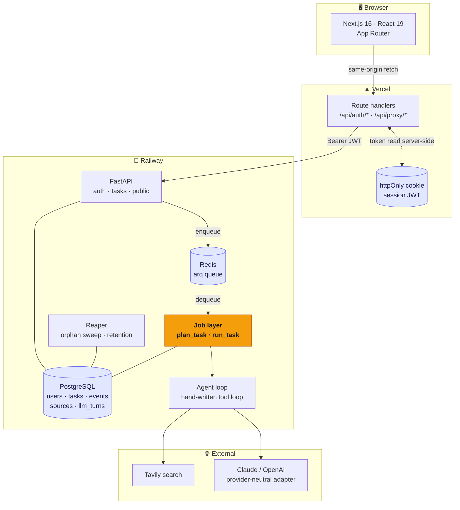
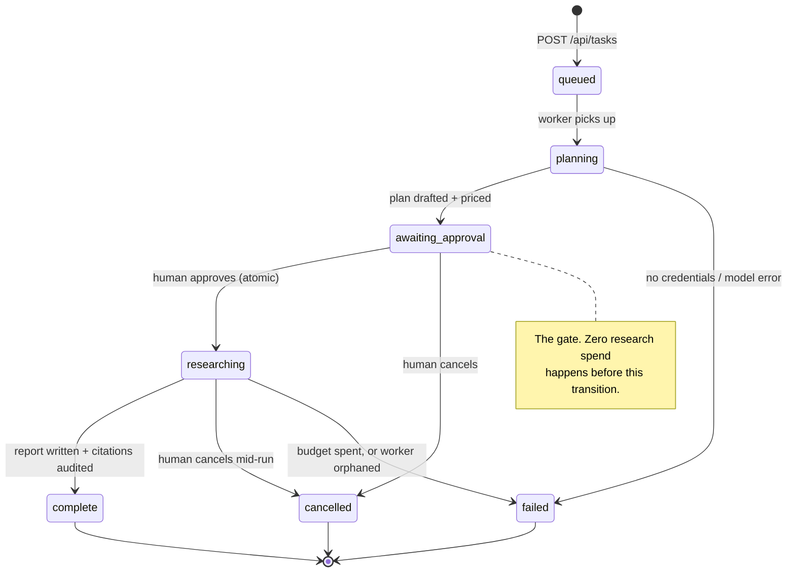

# Human in the Loop

A deep-research agent that **asks permission before it spends your money**, and
**proves its sources exist** before it hands you a report.

Most research agents are a prompt box wired to a tool loop: you ask, it burns
tokens unattended, and you get prose full of confident citations you have to
check by hand. This one puts a person at the two moments that matter — before
the spend, and after the claims.

> **Live demo:** _not yet deployed — see [Deployment](#deployment) for the
> 15-minute path to a public URL._

---

## The two ideas

### 1. The approval gate has a price tag

The agent drafts a plan, then **stops**. You see the steps, edit them, answer any
clarifying questions — and see **what approving it will cost**, recalculated as
you add or remove steps.

```
Estimated cost to run this plan
$0.15          range $0.12–$0.26
~5 searches    ~6 model turns     claude-opus-5
```

An approval screen that only asks "does this look right?" is a rubber stamp.
Showing the dollar figure makes it a decision. Not one token of research spend
happens before you click.

### 2. Every citation is checked against what was actually retrieved

The agent keeps a ledger of every URL a search really returned. When the report
is written, its links are diffed against that ledger:

- **Verified** — the agent genuinely fetched this page.
- **Unverified** — the URL appears in the report but *no search ever returned
  it*. It came from the model's memory.

Unverified links are surfaced in the UI and stored on the task. This is a
mechanism, not a prompt instruction — which is why it can be trusted. See
[`api/app/agent/citations.py`](api/app/agent/citations.py).

---

## Architecture



**The token never reaches client JavaScript.** The browser talks only to the
Next.js origin; route handlers read the httpOnly cookie server-side and attach
the `Authorization` header. An XSS bug cannot exfiltrate a session, and there
are no third-party cookies to be blocked.

### Task lifecycle



### Where the money goes

Every model call is recorded in `llm_turns` — tokens, **dollars**, latency, tool
calls, retry count, cache hits. That makes a disappointing report debuggable
after the fact and lets the cost estimates be calibrated against reality instead
of staying guesses.

---

## Design decisions

### Why PostgreSQL and not MongoDB

The honest version, because the usual answer ("Postgres is ACID") is only half
of it — Mongo's `findOneAndUpdate` is atomic too.

**1. The data is genuinely relational.** One user has many tasks; one task has
many events, sources, and model turns. That is four foreign keys, not four
embedded arrays. Events alone can run to dozens per task and are queried by
cursor — embedding them in a task document would mean rewriting the whole
document on every append.

**2. Deletion has to be real, and declarative.** "We store your search history"
obliges an account-deletion path. `ON DELETE CASCADE` makes that one statement
that cannot forget a table. In a document store the cascade is application code,
and application code drifts.

**3. The approval gate is a conditional state transition.** Two clicks must not
buy two research runs, so the transition is:

```sql
UPDATE research_tasks SET status = 'researching', ...
WHERE id = :id AND status = 'awaiting_approval'
RETURNING id
```

The loser gets zero rows back and a 409. Mongo could express this too — the
deciding factor was that this sits alongside the joins and cascades above, not
that it is uniquely possible in SQL.

**4. Cost reporting is aggregation.** "Spend per user per day", "cache hit rate
across turns" are three-line SQL queries against `llm_turns`.

**5. We give up nothing.** The genuinely document-shaped fields — the plan, the
clarifying questions, the citation report, event payloads — are `JSON` columns.
Postgres is a perfectly good document store when you need one.

Schema changes go through Alembic, so evolution is explicit and reviewable
rather than deferred to read-time.

### The hardest bug

**Symptom:** tasks froze in `planning` forever. No error, no log line, no
failure — the row simply stopped changing. Only the 15-minute orphan reaper
eventually noticed.

**Diagnosis.** The task reached `planning`, so the provider had been constructed
and the status write had succeeded. The next statement was the model call, so
something in there was raising an exception that nothing caught. Reproducing the
call directly with the deployed config gave it up:

```
TypeError: Could not resolve authentication method. Expected one of
api_key, auth_token, or credentials to be set.
```

`ANTHROPIC_API_KEY=""` in the env file. An **empty string is not the same as
unset**: it overrode the SDK's own credential resolution, and the SDK signalled
that with a plain `TypeError` — not one of its own error classes. Every
`except LLMError` in the job layer missed it, the fire-and-forget asyncio task
died silently, and nothing ever wrote a failure to the row.

**Fix, in three layers**, because any one alone would have left the same class of
bug possible:

1. Empty key now coerces to `None`, so SDK credential resolution works as
   intended (env var, `ant auth login` profile).
2. `TypeError` is mapped to `LLMError` with an actionable message.
3. `plan_task` gained the broad `except Exception` safety net `run_task` already
   had, and the in-process queue logs unhandled task exceptions.

Now it fails in under a second, in the UI, with something you can act on:

```
[1] status: Drafting a research plan for your review.
[2] error:  No Anthropic credentials found. Set ANTHROPIC_API_KEY
            (or run `ant auth login`).
```

**The lesson worth keeping:** a background task that dies silently is worse than
one that crashes loudly. Every job now has a path that ends in a written status,
and there are regression tests for both the unexpected-exception and
provider-construction-failure cases.

### Performance

| Optimisation | Mechanism | Effect |
|---|---|---|
| **Prompt caching** | The system prompt + tool schemas are byte-identical across every turn of a run, so they carry a cache breakpoint. Cached input bills at 10% of fresh input. | ~29% lower modelled cost on a 4-step plan. Cache reads/writes are tracked separately in `llm_turns` so the real rate is measurable. |
| **Parallel tool calls** | Models emit several searches per turn. `asyncio.gather` runs them concurrently, then reassembles results in call order (tool results must line up with their `tool_use` ids). | N searches per turn become one round trip instead of N. |
| **Cursor-based polling** | `GET /events?after=N` returns only unseen events. The naive version refetched the entire task — every event and source — every 1.5s. | Polling payload stays flat instead of growing for the length of the run. |
| **Per-run search memo** | A repeated query is served from the run's memo. | A repeat costs no API call *and* no budget. |
| **No transactions held across model calls** | A research run takes minutes. Progress hooks open a short session, write, and close. | The connection pool is never pinned by a slow model call. |

Caveat worth stating plainly: the 29% is **modelled** from the cost estimator,
not measured in production. `llm_turns` exists precisely so those constants can
be replaced with observed numbers.

---

## Testing

**99 tests, all hermetic** — no API key, no network, no spend. The agent is
driven by scripted fake providers, so the loop's guarantees are tested as
properties of *our* code rather than of a model's behaviour.

```bash
cd api && .venv/bin/python -m pytest -q
# 99 passed
```

| Suite | Tests | What it pins down |
|---|---:|---|
| `test_agent_loop.py` | 21 | Spend caps (search/turn/token), cancellation mid-run, source vetoes, parallel tool execution, result ordering, memoisation, empty-report guard |
| `test_jobs_pipeline.py` | 11 | Planning → pricing → approval, citation auditing, telemetry, and the wedged-task regressions |
| `test_approval_gate.py` | 10 | **Concurrent double-approval starts exactly one run**, edit detection, cursor feed, cross-user isolation |
| `test_tasks.py` | 10 | Task lifecycle endpoints |
| `test_auth.py` | 9 | Registration, login, account deletion cascade |
| `test_reaper.py` | 8 | Orphan detection, live runs left alone, retention purge |
| `test_pricing.py` | 7 | Cost maths, cache discount, estimate bounds, unpriced-model flagging |
| `test_citations.py` | 6 | URL normalisation, invented-citation detection |
| `test_ratelimit.py` | 4 | Sliding window, per-key isolation, window expiry |
| `test_retry.py` | 4 | Transient retried, fatal not retried, attempt accounting |
| `test_public.py` | 3 | Public report visibility rules |

The tests worth reading first are `test_approval_gate.py::test_concurrent_approvals_only_start_one_run`
and `test_jobs_pipeline.py::test_invented_citation_is_caught_and_surfaced` —
they encode the two claims this project actually makes.

---

## Local development

**Requirements:** Python 3.13+, Node 20+, PostgreSQL 16 (or use Docker).

### With Docker (full stack, including Redis + worker)

```bash
cp .env.example .env          # set JWT_SECRET and at least one model key
docker compose up --build
```

Web on `:3000`, API on `:8000`, Swagger on `:8000/docs`.

### Without Docker

```bash
# Postgres
createdb hitl

# API
cd api
python3 -m venv .venv && .venv/bin/pip install -r requirements.txt
cp ../.env.example .env       # then set DATABASE_URL + JWT_SECRET
.venv/bin/alembic upgrade head
.venv/bin/uvicorn app.main:app --reload --port 8000

# Web (second terminal)
cd web && npm install && npm run dev
```

With no `REDIS_URL`, jobs run in-process — fine on a laptop, but a restart
mid-run orphans the task (the reaper will fail it cleanly). With no
`TAVILY_API_KEY`, search falls back to a clearly-labelled stub so the whole flow
is still demoable.

**macOS note:** PDF export needs Pango. `brew install pango`, and run the API
with `DYLD_FALLBACK_LIBRARY_PATH=/opt/homebrew/lib`. Without it, PDF export
returns a clean 503 rather than failing at boot.

### Configuration

| Variable | Default | Notes |
|---|---|---|
| `DATABASE_URL` | local Postgres | `sqlite+aiosqlite:///./hitl.db` works as a no-daemon fallback |
| `REDIS_URL` | unset | Unset ⇒ jobs run in-process |
| `JWT_SECRET` | — | **Required in production.** `python -c "import secrets; print(secrets.token_urlsafe(48))"` |
| `LLM_PROVIDER` | `anthropic` | `anthropic` \| `openai` |
| `ANTHROPIC_API_KEY` / `OPENAI_API_KEY` | unset | Leave *unset*, not empty — see [the hardest bug](#the-hardest-bug) |
| `TAVILY_API_KEY` | unset | Unset ⇒ stub search |
| `MAX_SEARCHES_PER_TASK` | `8` | Hard cap per task |
| `MAX_TOOL_ITERATIONS` | `12` | Hard cap per task |
| `MAX_OUTPUT_TOKENS_PER_TASK` | `60000` | Hard cap per task |
| `MAX_TASKS_PER_USER_PER_DAY` | `25` | Per-user quota |
| `DATA_RETENTION_DAYS` | `0` | `0` keeps history forever — an explicit choice |
| `AUTO_CREATE_SCHEMA` | `true` | Set `false` in production; Alembic owns the schema |

---

## Deployment

Two services. Roughly 15 minutes.

### Backend → Railway

1. **New Project → Deploy from GitHub repo**, root directory `api`.
   [`railway.json`](api/railway.json) and the [`Dockerfile`](api/Dockerfile) are
   already there; migrations run on boot and `/api/health` is the healthcheck.
2. **Add PostgreSQL** and **Add Redis** from the Railway dashboard. Both inject
   their connection URLs automatically.
3. Set variables: `DATABASE_URL` (swap Railway's `postgresql://` prefix for
   `postgresql+asyncpg://`), `REDIS_URL`, `JWT_SECRET`, your model key,
   `TAVILY_API_KEY`, `AUTO_CREATE_SCHEMA=false`, and `CORS_ORIGINS` set to your
   Vercel URL.
4. **Add a second service** from the same repo for the worker, with start
   command `arq app.worker.WorkerSettings` and the same variables. Without it,
   queued jobs are never consumed.

### Frontend → Vercel

1. **Import the repo**, set **Root Directory** to `web`.
2. One environment variable: `API_URL` = your Railway API URL. It is read
   server-side only — the browser never sees it.
3. Deploy, then put the URL back into the API's `CORS_ORIGINS`.

Then replace the "Live demo" line at the top of this README with the link.

---

## API reference

| Method | Endpoint | Description | Auth |
|:---|:---|:---|:---:|
| `POST` | `/api/auth/register` | Create an account (throttled per IP) | — |
| `POST` | `/api/auth/login` | Log in (throttled per IP) | — |
| `GET` | `/api/auth/me` | Current user | ✓ |
| `DELETE` | `/api/auth/me` | Delete account and all its data | ✓ |
| `POST` | `/api/tasks` | Create a task, trigger plan drafting | ✓ |
| `GET` | `/api/tasks` | List your tasks | ✓ |
| `GET` | `/api/tasks/{id}` | Full task: plan, events, sources, citation report | ✓ |
| `GET` | `/api/tasks/{id}/events?after=N` | **Incremental** progress feed | ✓ |
| `GET` | `/api/tasks/{id}/estimate` | Cost of the saved plan | ✓ |
| `POST` | `/api/tasks/{id}/estimate` | Cost of a plan being edited | ✓ |
| `POST` | `/api/tasks/{id}/approve` | **The gate.** Atomic; a second call gets 409 | ✓ |
| `POST` | `/api/tasks/{id}/cancel` | Cancel; the loop checks between turns | ✓ |
| `POST` | `/api/tasks/{id}/sources/{sid}/toggle` | Veto a source | ✓ |
| `POST` | `/api/tasks/{id}/share` | Toggle public link | ✓ |
| `GET` | `/api/tasks/{id}/pdf` | Report as PDF (WeasyPrint) | ✓ |
| `GET` | `/api/public/reports/{share_id}` | Public report | — |
| `GET` | `/api/health` | Health + how the deployment is wired | — |

---

## Stack

**Backend** FastAPI · SQLAlchemy 2.0 async · Alembic · Pydantic v2 · asyncpg ·
arq · bcrypt + JWT · WeasyPrint
**Models** Anthropic and OpenAI behind one provider-neutral interface — no
LangChain; the tool loop is [~150 lines you can read](api/app/agent/loop.py)
**Search** Tavily, with a deterministic offline stub
**Frontend** Next.js 16 App Router · React 19 · Tailwind CSS v4 · TypeScript

---

## Known limits

Worth saying out loud, because a portfolio project that claims to be finished is
less credible than one that knows its edges:

- **Rate limiting is per-process.** The sliding window lives in memory, so behind
  more than one API instance the limit is per-instance. Move it to Redis before
  scaling out.
- **Anyone can self-register.** Before making a deployment public, gate signup
  (invite code, allowlist) or the per-user quota is just a per-signup quota.
- **Cost estimates are uncalibrated.** The constants in
  [`pricing.py`](api/app/pricing.py) are documented heuristics, not measurements.
- **OpenAI pricing is not bundled** — set `OPENAI_PRICE_INPUT` /
  `OPENAI_PRICE_OUTPUT`, or estimates are flagged as unverified in the UI.
- **Structured output and the refusal-fallback beta are untested against a live
  API.** They follow the documented shapes and degrade on a 400, but the first
  real call is the real test.
